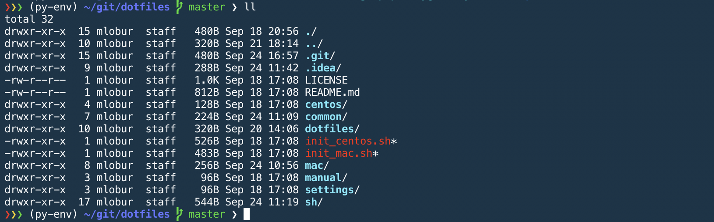

```
     _       _    __ _ _           
  __| | ___ | |_ / _(_) | ___  ___ 
 / _` |/ _ \| __| |_| | |/ _ \/ __|
| (_| | (_) | |_|  _| | |  __/\__ \
 \__,_|\___/ \__|_| |_|_|\___||___/

```
Easy mac and linux bootstrap



The above color theme is [Cobalt2](https://github.com/wesbos/Cobalt2-iterm)

## How to Use
1. Click `Use this template`, or fork the repo 
2. Update [vars.sh](./vars.sh)
3. Review the [init](./init) scripts, enable/disable parts
4. Run `./init.sh`

## Troubleshooting
All scripts are idempotent - hack & rerun until it works.
