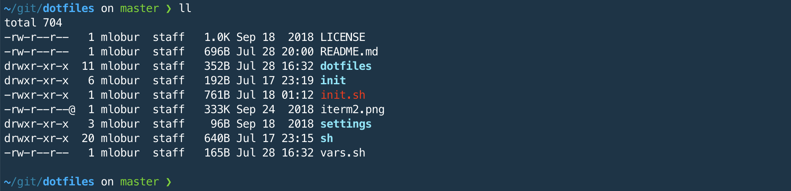

```
     _       _    __ _ _           
  __| | ___ | |_ / _(_) | ___  ___ 
 / _` |/ _ \| __| |_| | |/ _ \/ __|
| (_| | (_) | |_|  _| | |  __/\__ \
 \__,_|\___/ \__|_| |_|_|\___||___/

```
Zero friction mac and linux bootstrap


## macOS
```
mkdir ~/git && cd ~/git
git clone https://github.com/max-lobur/dotfiles.git && cd dotfiles
git remote set-url origin git@github.com:max-lobur/dotfiles.git  # ssh push later
./init.sh
```

## Ubuntu | RHEL
```
sudo apt-get install -y install git
git clone https://github.com/max-lobur/dotfiles.git && cd dotfiles
./init.sh
```

## Troubleshooting
All scripts are idempotent - hack & rerun until it works.
